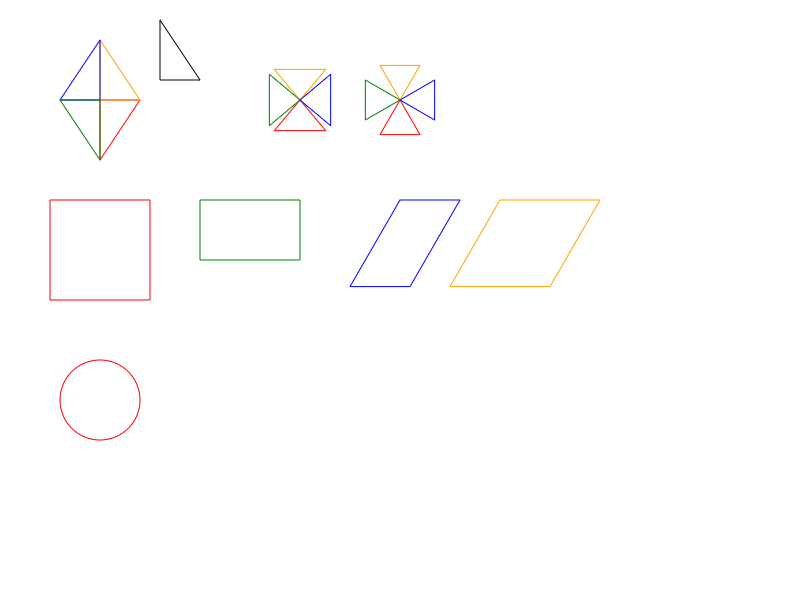

# LearningAndEducation
scripts and tools for learning and education
- The math bilingual learning tool is played like this:

  by clicking the next or previous button, you can browse the words pairs one by one.
- The geometry figures tool kit will draw figures like this:

